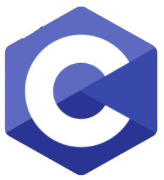
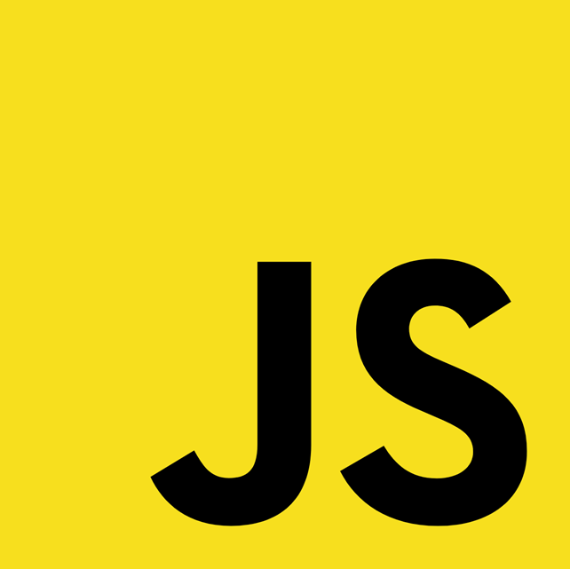
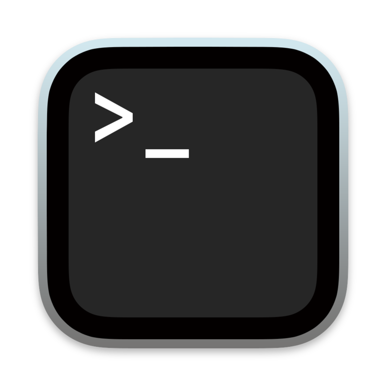
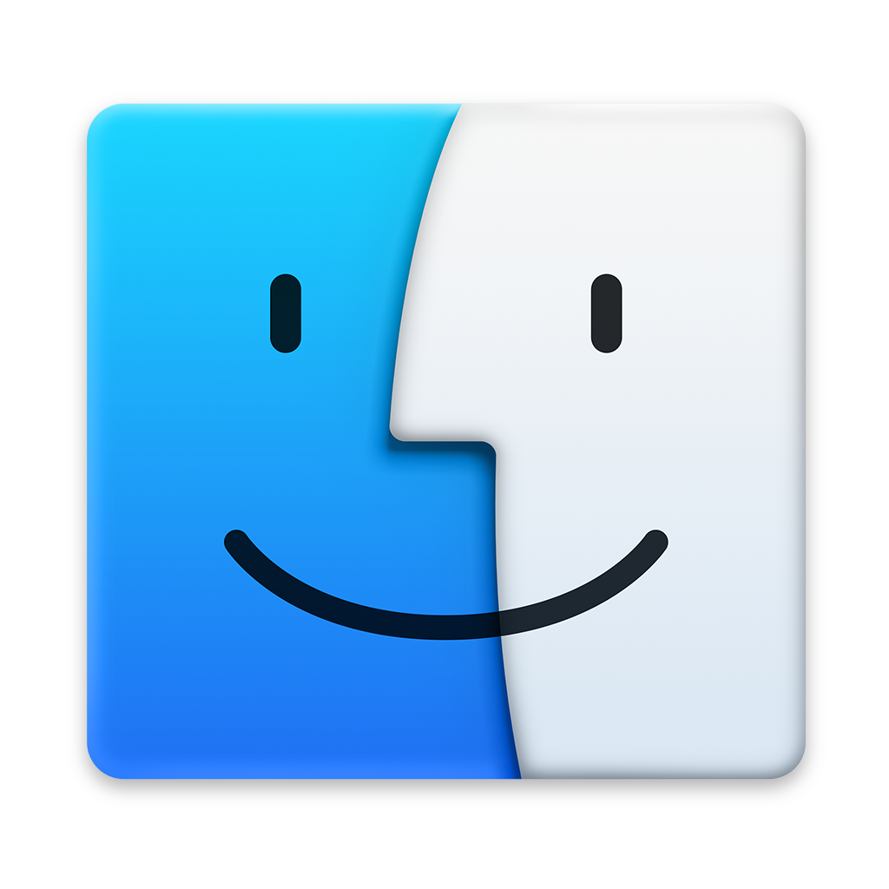
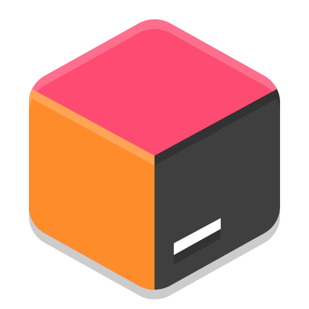

### Hi there, fellow \<dev\> 👋

- My name is Alexander Skytt Steffensen 🙋‍♂️
- Living in Aalborg, Denmark 🌇
- I'm currently studying Software at Aalborg University (AAU) 👨🏼‍💻
- I'm also a runner 🏃‍♂️

<h3> 🛠 &nbsp;Tech Stack</h3>

Languages and Frameworks: 

|  |  |  |  |
|---|---|---|---|

Tools: 

|  |  |  |  |  |
|---|---|---|---|---|---|---|

<h3> 👥 &nbsp;Socials</h3>

|  |  |
|---|---|

  
✨ Github Stats

   
  
   
   
   
   
   
   
   
   
   

  
🔥 Top languages

   
    
   
   
   
   
   
   
   
   
   
  <b>Note:</b> This chart is only a metric of which languages my public code on GitHub consists of and does not reflect my experience or skill level.
   

